# Guía paso a paso del Módulo de Tarjetas (Tesorería Comfacauca V2)

Esta guía explica cómo funciona cada pantalla del módulo, qué archivo espera, qué hace con él y cómo leer el resultado. Las capturas se tomaron con **archivos de ejemplo ficticios** (están en [`docs/ejemplos/`](ejemplos/)), así que puedes repetir cada paso.

---

## 0. Cómo funciona el módulo en general

El módulo es una aplicación web **100 % en el navegador** (HTML + CSS + JavaScript puro). No tiene servidor ni base de datos:

- El archivo se lee en tu equipo con `FileReader`; **nada se sube a internet**.
- Cada pantalla es independiente: tiene su propio `.html` y su propio `.js`.
- Todas comparten el mismo diseño (`css/app.css`) y los mismos componentes: zona de carga (`css/dropzone.js`), tabla con búsqueda/orden/paginación (`css/datatable.js`) y menú lateral (`css/layout.js`).

El flujo es el mismo en todas las pantallas:

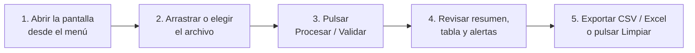

### Cómo abrirlo

1. Descarga o clona el repositorio.
2. Abre `index.html` en el navegador. Recomendado, con un servidor local:
   ```bash
   python -m http.server 8080
   ```
   y entra a <http://localhost:8080>.
3. Se necesita internet para cargar fuentes, íconos (Font Awesome) y la librería SheetJS (para leer/exportar Excel).

### La pantalla de inicio

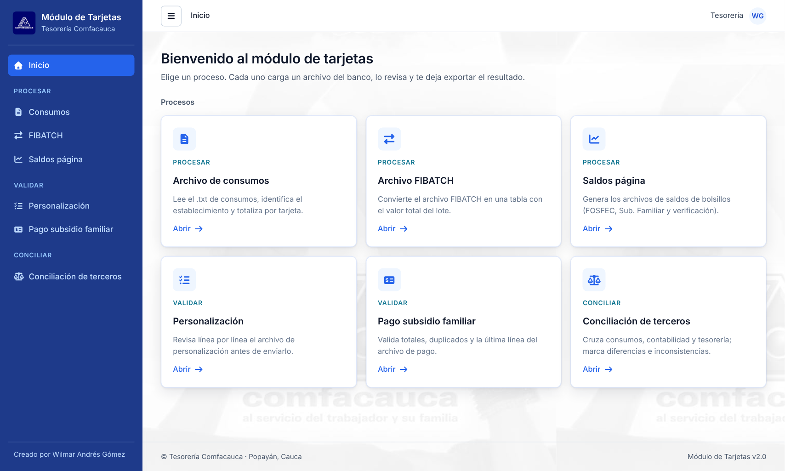

- **Menú lateral** (izquierda): agrupa las pantallas en **Procesar**, **Validar** y **Conciliar**. El botón ☰ de arriba lo oculta o lo muestra.
- **Tarjetas del centro**: acceso directo a cada proceso (botón *Abrir*).

| Grupo | Pantalla | Para qué sirve | Archivo de entrada |
|---|---|---|---|
| Procesar | Consumos | Totaliza los consumos del banco y marca comercios no registrados | `.txt` del banco (`T636876…`) |
| Procesar | FIBATCH | Convierte el archivo FIBATCH a tabla y suma el lote | `.txt` FIBATCH |
| Procesar | Saldos página | Genera los Excel de saldos por bolsillo | `.txt`/`.csv` separado por `;` |
| Validar | Personalización | Revisa línea por línea el archivo antes de enviarlo a ASOPAGOS | `.txt` de 513 caracteres por línea |
| Validar | Pago subsidio familiar | Valida totales, duplicados y última línea | `.txt` de pago |
| Conciliar | Conciliación de terceros | Cruza Contabilidad, Tesorería y Consumos | 2–3 archivos Excel/CSV |

---

## 1. Procesar → Consumos

**Objetivo:** leer el archivo de consumos del banco, saber en qué comercio se hizo cada compra y obtener los totales por día y por archivo.

### Paso a paso

1. Menú **Procesar → Consumos**.

   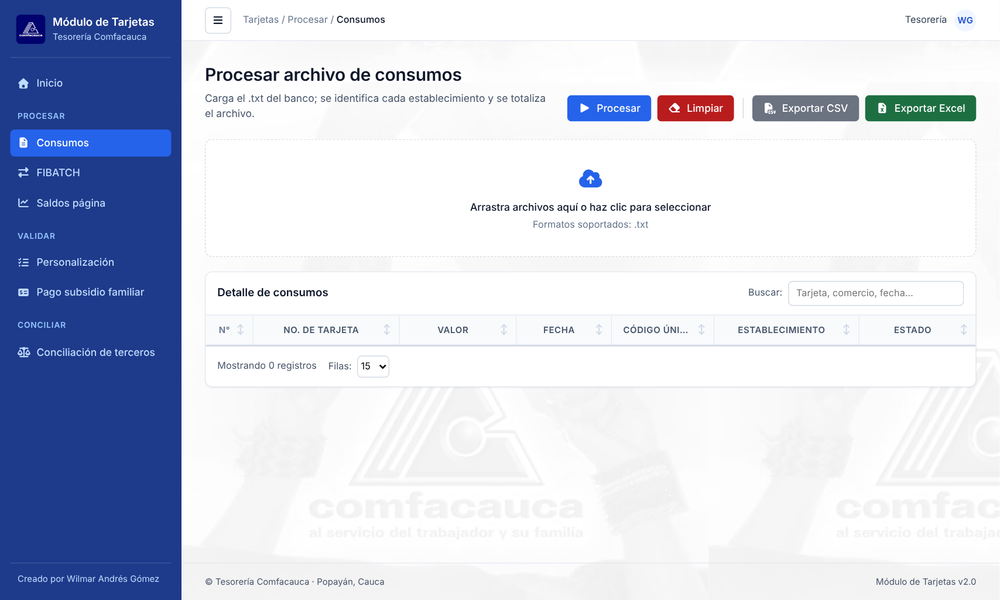

2. Arrastra el archivo a la zona punteada (o haz clic para elegirlo). La zona se pone verde y muestra nombre y tamaño.

   > **El nombre importa.** Debe empezar por `T636876` y terminar en `NNN` (mes de 1 dígito + día, ej. `T636876811`) o en letra `A/B/C` + día (ej. `T636876A01`). Si no, la página muestra un aviso y no procesa.

   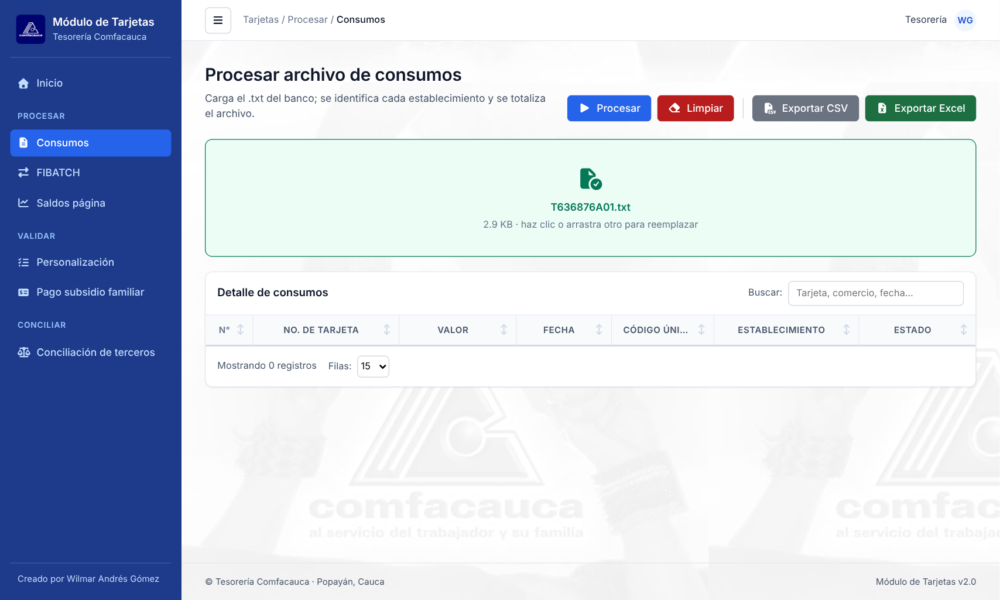

3. Pulsa **Procesar**. Aparece el resultado:

   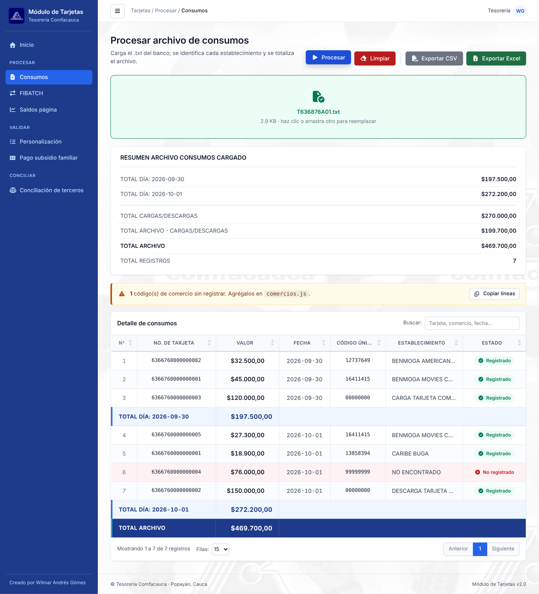

### Qué hace por dentro

Cada línea del `.txt` es de **ancho fijo**; el código toma partes por posición:

| Dato | Posición (caracteres) |
|---|---|
| No. de tarjeta | 9 – 26 |
| Valor | 124 – 139 |
| Fecha (`AAAAMMDD`) | 158 – 166 |
| Código único del comercio | 333 – 341 |
| Tipo (`CARGOS` / `ABONO`) | se busca el texto dentro de la línea |

Con el **código único** busca el nombre en `Consumos/comercios.js`:

- Código `00000000` + `ABONO` → **CARGA TARJETA COMFACAUCA**
- Código `00000000` + `CARGOS` → **DESCARGA TARJETA COMFACAUCA**
- Código que está en `comercios.js` → nombre del comercio (**Registrado**)
- Código que no está → **NO ENCONTRADO** (**No registrado**)

### Cómo leer el resultado

- **Resumen** (arriba): total por día, total de cargas/descargas, total del archivo, total del archivo sin cargas/descargas y número de registros.
- **Aviso amarillo**: aparece si hay comercios sin registrar. El botón **Copiar líneas** deja en el portapapeles las líneas listas para pegar en `Consumos/comercios.js`:
  ```js
  "12345678": "NOMBRE DEL COMERCIO",
  ```
  Cambia el texto por el nombre real y vuelve a procesar.
- **Tabla de detalle**: ordenada por fecha; las filas sin registrar salen en rojo. Después del último movimiento de cada día aparece **TOTAL DÍA** y al final **TOTAL ARCHIVO**.
- **Buscar / ordenar / paginar**: escribe en *Buscar*; haz clic en un encabezado para ordenar (1.er clic ascendente, 2.º descendente, 3.º vuelve al orden original); *Filas* cambia cuántas se ven.
- **Exportar CSV / Excel**: siempre exporta **todos** los registros, sin importar el filtro. **Limpiar** deja la pantalla en blanco.

---

## 2. Procesar → FIBATCH

**Objetivo:** ver el archivo FIBATCH como tabla y obtener el **valor total del lote**.

### Paso a paso

1. Menú **Procesar → FIBATCH**.
2. Carga el `.txt` y pulsa **Procesar**.
3. Revisa el total y la tabla:

   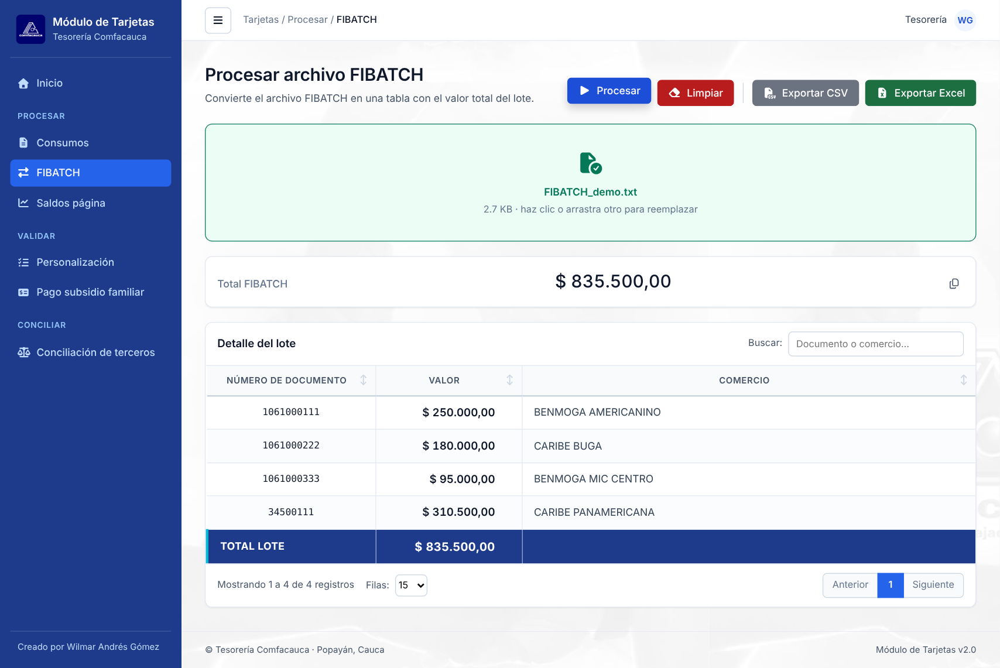

4. Usa el icono de copiar junto al **Total FIBATCH** para copiar el valor.
5. Exporta a CSV o Excel si lo necesitas.

### Qué hace por dentro

- Recorre las líneas **menos las dos últimas** (la de cierre del lote y la vacía final).
- Por posición toma: **número de documento** (75 – 94), **valor** (179 – 194) y **comercio** (489 – 550).
- Suma todos los valores en **Total FIBATCH** (arriba) y en **TOTAL LOTE** (pie de tabla). Si filtras, además aparece **TOTAL FILTRADO**.

---

## 3. Procesar → Saldos página

**Objetivo:** generar los Excel de saldos que se publican en la página, uno por bolsillo, más uno de verificación.

### Paso a paso

1. Menú **Procesar → Saldos página**.
2. Carga el archivo `.txt` o `.csv` (separado por `;`, con una línea de cabecera: `CEDTAR;NOMBRES;BOLSILLO;SALDO`) y pulsa **Procesar**.

   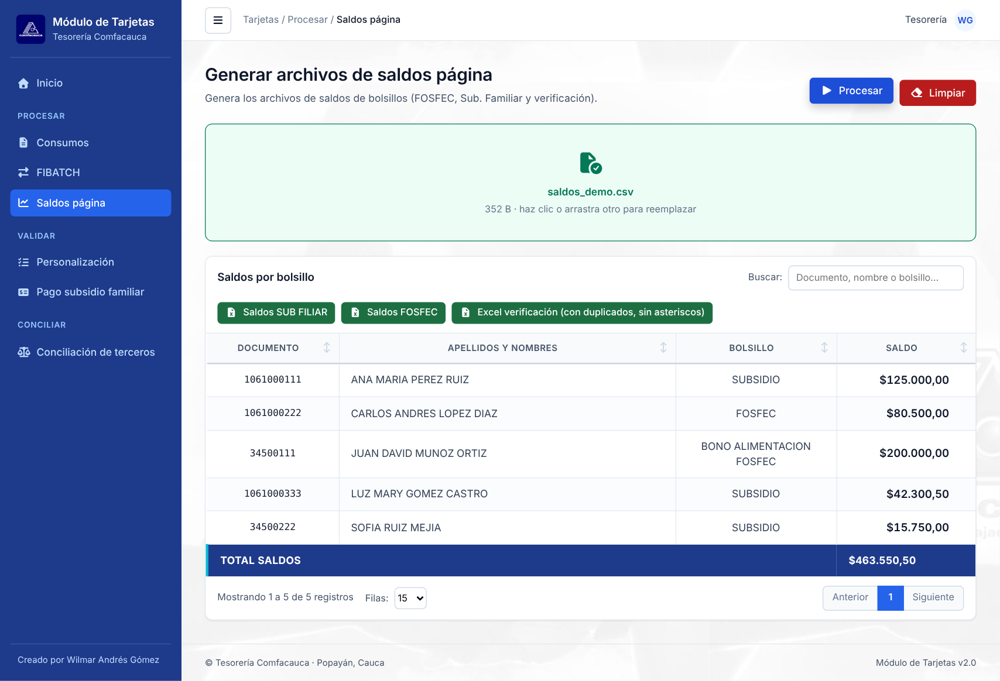

3. Elige el Excel que necesitas:

| Botón | Qué contiene |
|---|---|
| **Saldos SUB FILIAR** | Solo bolsillo `SUBSIDIO` |
| **Saldos FOSFEC** | Bolsillos `FOSFEC` y `BONO ALIMENTACION FOSFEC` |
| **Excel verificación** | **Todos** los registros, **con duplicados y sin enmascarar** |

### Qué hace por dentro

- Ignora la primera línea (cabecera) y convierte el saldo de `125.000,00` a número.
- **Corrige la codificación** de nombres (por ejemplo `?` → `Ñ`, tildes mal leídas).
- **Elimina duplicados exactos** (mismo documento + nombre + bolsillo) para la tabla y los Excel de SUBSIDIO/FOSFEC; los ordena alfabéticamente por nombre.
- En los Excel de SUBSIDIO y FOSFEC la cédula sale **enmascarada**: `******` + últimos 3 dígitos (ej. `******111`).
- Los archivos se llaman con la fecha de **ayer**: `SaldosPagina a dd-mm-aaaa Subsidio.xlsx`, `… Fosfec.xlsx` y `SaldosVerificacion a dd-mm-aaaa.xlsx`.

> En la captura, la fila repetida de *ANA MARIA PEREZ RUIZ* ya aparece una sola vez en la tabla, pero seguirá en el Excel de verificación.

---

## 4. Validar → Personalización

**Objetivo:** revisar el archivo de personalización **antes** de cargarlo a ASOPAGOS.

### Paso a paso

1. Menú **Validar → Personalización**.
2. Carga el `.txt` (solo acepta `.txt`; el botón **Procesar** se habilita al cargarlo).
3. Pulsa **Procesar**.

### Resultado con errores

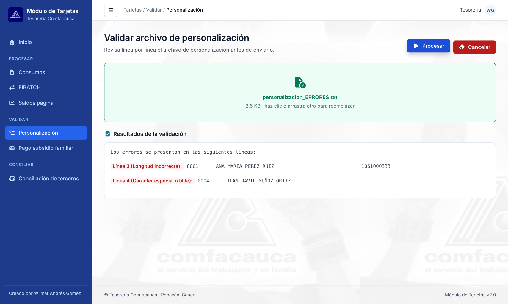

Cada línea con problema se lista en rojo con su número y el motivo:

- **Longitud incorrecta**: la línea no mide exactamente **513 caracteres**.
- **Carácter especial o tilde**: contiene tildes, `Ñ`, o símbolos como `! @ # $ % & ( ) , . ? " : { } | < > + - /` o el carácter de reemplazo `�`.

Corrige el archivo de origen y vuelve a procesarlo.

### Resultado sin errores

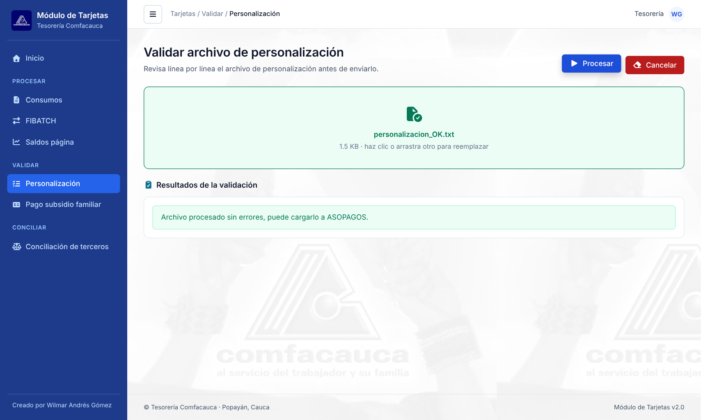

Si todo está bien aparece el mensaje verde *“Archivo procesado sin errores, puede cargarlo a ASOPAGOS.”*

> Se validan todas las líneas **excepto la última** del archivo. **Cancelar** limpia todo.

---

## 5. Validar → Pago subsidio familiar

**Objetivo:** comprobar que el archivo de pago esté cuadrado antes de enviarlo.

### Paso a paso

1. Menú **Validar → Pago subsidio familiar**.
2. Carga el `.txt` y pulsa **Validar archivo**.

   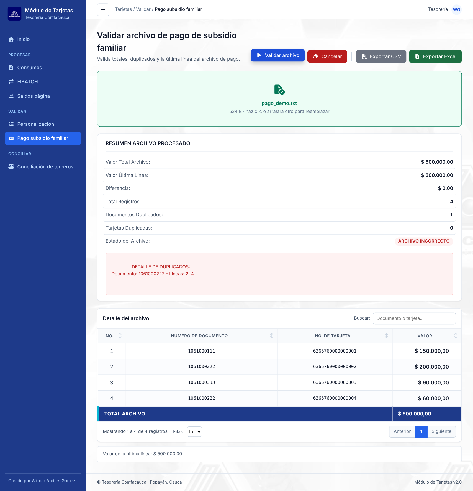

### Qué verifica

Por posición toma de cada línea el **documento** (30 – 45), la **tarjeta** (64 – 81) y el **valor** (83 – 99). La **última línea** es el control: su valor (68 – 85) debe ser igual a la suma de todas las anteriores.

| Campo del resumen | Significado |
|---|---|
| Valor Total Archivo | Suma de todas las líneas de detalle |
| Valor Última Línea | Total de control que trae el archivo |
| Diferencia | Total − Última línea (debe ser **0**) |
| Documentos / Tarjetas duplicados | Cuántos números aparecen más de una vez |
| **Estado del Archivo** | **ARCHIVO CORRECTO** solo si no hay duplicados **y** la diferencia es 0 |

Si hay duplicados, el recuadro rojo lista **en qué líneas** está cada uno. En la captura, el documento `1061000222` se repite en las líneas 2 y 4, por eso el estado es **ARCHIVO INCORRECTO** aunque los totales cuadran.

La tabla de detalle tiene búsqueda, orden y paginación, y se puede exportar a CSV/Excel.

---

## 6. Conciliar → Conciliación de terceros

**Objetivo:** comparar el saldo que dice Contabilidad con el que dice Tesorería (descontando los consumos pendientes) y señalar diferencias e inconsistencias.

### Paso a paso

1. Menú **Conciliar → Conciliación de terceros**.

   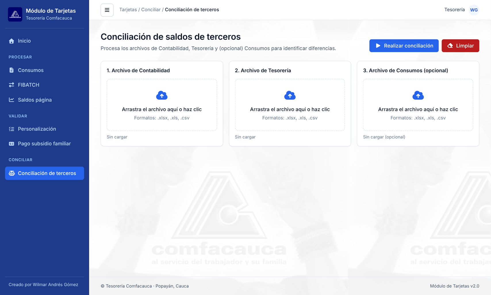

2. Carga los archivos Excel/CSV en sus tarjetas:
   1. **Contabilidad** (obligatorio)
   2. **Tesorería** (obligatorio)
   3. **Consumos** (opcional; es el Excel exportado desde la pantalla *Consumos*)

   Al cargar cada uno la página revisa que tenga las **columnas obligatorias** y lo indica debajo de la zona:

   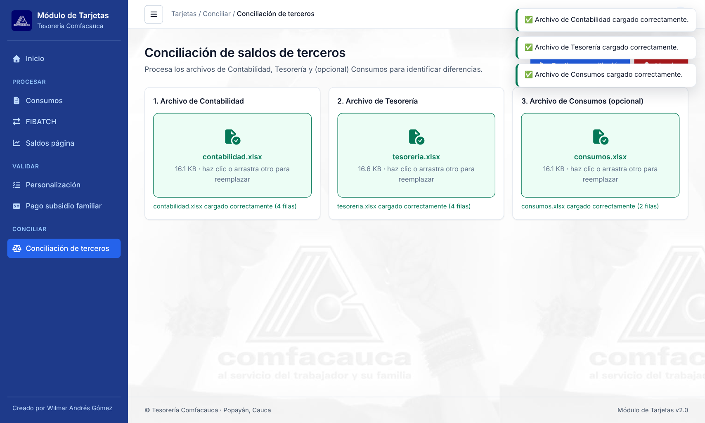

   | Archivo | Columnas que debe tener (acepta variantes de nombre) |
   |---|---|
   | Contabilidad | `DOCUMENTO`, `APELLIDOS Y NOMBRES`, `SALDO` |
   | Tesorería | `CEDULA TRABAJADOR`, `NUMERO TARJETA`, `BOLSILLO`, `SALDO`, `ULTIMA CARGA TARJETA COMFACAUCA`, `ULTIMO COBRO USUARIO` |
   | Consumos | `N°`, `No. de Tarjeta`, `Valor`, `Fecha`, `Código Único`, `Establecimiento` |

   Si falta alguna, se muestra en rojo *“Faltan columnas: …”* y no se puede conciliar hasta corregirlo.

3. Pulsa **Realizar conciliación**.

   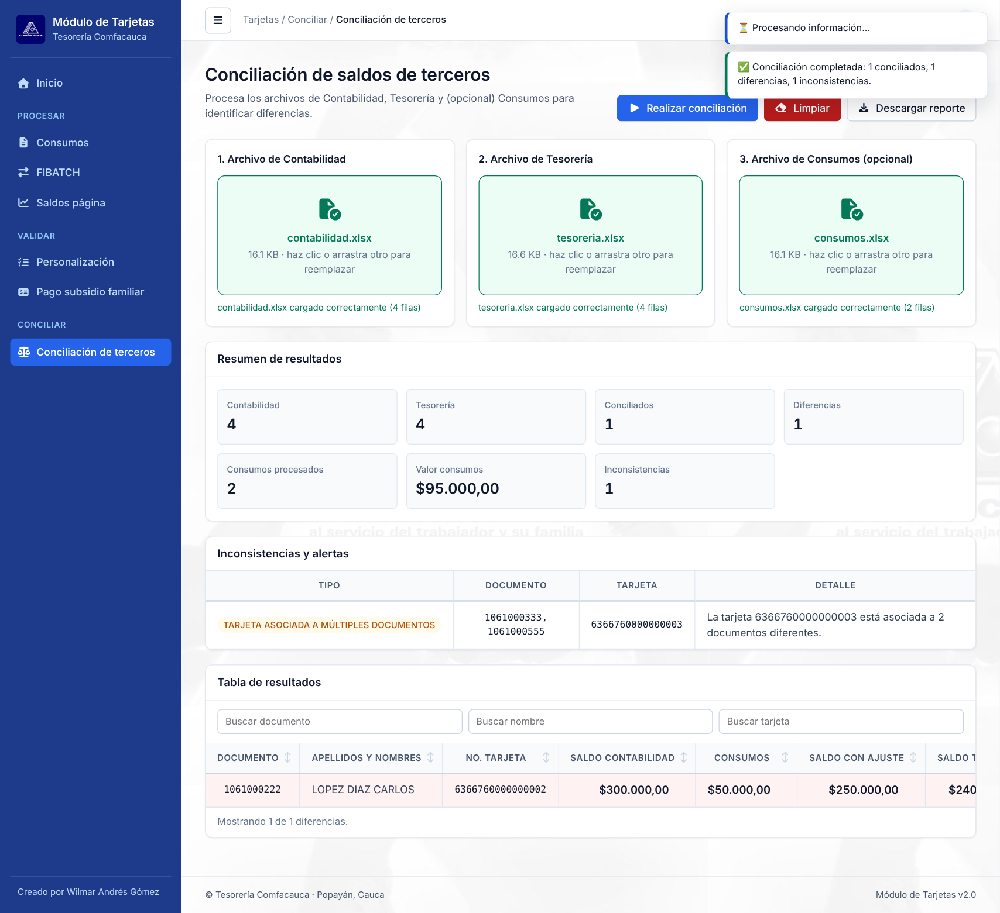

4. Revisa el resumen, las inconsistencias y la tabla; pulsa **Descargar reporte** para obtener el Excel con los resultados. **Limpiar** reinicia todo.

### Qué hace por dentro

1. **Normaliza** los datos (documentos sin espacios, tarjetas sin guiones/puntos, saldos con formato colombiano o con `$`, paréntesis o signo negativo).
2. **Valida integridad** y marca como *inconsistencias* (y excluye de la conciliación) los casos como:
   - documento vacío o duplicado en Contabilidad;
   - tarjeta vacía o no numérica en Tesorería;
   - un documento con **varias tarjetas**;
   - una tarjeta asociada a **varios documentos** (como en la captura).
3. **Procesa consumos**: suma los consumos por tarjeta. Si la tarjeta no está en Tesorería, el consumo se ignora; si la tarjeta es inválida o no tiene tercero asociado, se reporta como inconsistencia.
4. **Calcula por cada documento**:

   ```
   Saldo con ajuste = Saldo Contabilidad − Consumos de su tarjeta
   Diferencia       = Saldo con ajuste − Saldo Tesorería
   ```

   - |Diferencia| < 0,005 → **CONCILIADO**
   - Distinta → **DIFERENCIA**
   - Falta en uno de los dos archivos o hay problema estructural → **INCONSISTENCIA**

### Cómo leer el resultado

- **Resumen**: terceros en cada archivo, conciliados, diferencias, consumos procesados y su valor, e inconsistencias.
- **Inconsistencias y alertas**: tabla con tipo, documento, tarjeta y explicación.
- **Tabla de resultados**: muestra los terceros con diferencia (resaltados en rojo). Los filtros *Buscar documento / nombre / tarjeta* y el orden por columna ayudan a ubicar un caso. En el ejemplo, `1061000222` tiene saldo contable $300.000 − consumos $50.000 = $250.000, pero Tesorería dice $240.000 → diferencia de $10.000.

---

## 7. Mantenimiento: registrar un comercio nuevo

Cuando en **Consumos** aparezca *No registrado*:

1. Pulsa **Copiar líneas** en el aviso amarillo.
2. Abre `Consumos/comercios.js` y pega las líneas dentro del objeto `comercios`.
3. Cambia `NOMBRE DEL COMERCIO` por el nombre real.
4. Guarda y vuelve a procesar el archivo.

---

## 8. Archivos de ejemplo para practicar

Todos son ficticios y están en [`docs/ejemplos/`](ejemplos/):

| Archivo | Úsalo en |
|---|---|
| `T636876A01.txt` | Consumos (incluye un comercio no registrado, una carga y una descarga) |
| `FIBATCH_demo.txt` | FIBATCH |
| `saldos_demo.csv` | Saldos página (incluye una fila duplicada) |
| `personalizacion_ERRORES.txt` / `personalizacion_OK.txt` | Personalización |
| `pago_demo.txt` | Pago subsidio familiar (incluye un documento duplicado) |
| `contabilidad.xlsx`, `tesoreria.xlsx`, `consumos.xlsx` | Conciliación (genera 1 conciliado, 1 diferencia y 1 inconsistencia) |

---

## 9. Consejos y detalles a tener en cuenta

- Los archivos de ancho fijo se leen **por posición**: si el banco cambia el formato, hay que ajustar los números de posición en el `.js` de la pantalla correspondiente.
- Todo ocurre en tu navegador: si cierras o recargas la página se pierden los resultados (exporta antes).
- Los botones **Exportar** nunca dependen del filtro de la tabla: siempre salen todos los datos.
- En `Consumos/comercios.js` la clave `"00000000"` aparece dos veces; es inofensivo porque `scripts.js` la trata aparte (carga/descarga según `ABONO`/`CARGOS`).
